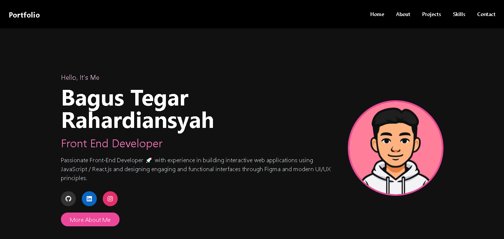

# 🌟 Bagus Tegar Rahardiansyah | Portfolio Website

This is my personal portfolio website built using **React.js**, **Vite**, and **Tailwind CSS**.  
It showcases my skills, projects, and provides a way to connect with me.

## ✨ Features

✅ Fully responsive design (mobile, tablet, desktop)  
✅ Smooth scrolling navigation  
✅ Project showcase section  
✅ Tech stack & tools tab view  
✅ Contact & social media links  
✅ Clean, modern UI with Tailwind CSS

---

## 🚀 Live Demo

👉 [View Live](https://portfolio-bagus.vercel.app/)

---

## 🛠 Built With

- [React.js](https://reactjs.org/)
- [Vite](https://vitejs.dev/)
- [Tailwind CSS](https://tailwindcss.com/)
- [React Icons](https://react-icons.github.io/react-icons/)
- [EmailJS](https://www.emailjs.com/) _(if enabled for contact form)_

---

## 📸 Screenshots



---

## 📦 Installation

Clone the repo:

```bash
git clone https://github.com/bagustgrh/portfolio.git
cd portfolio
```
